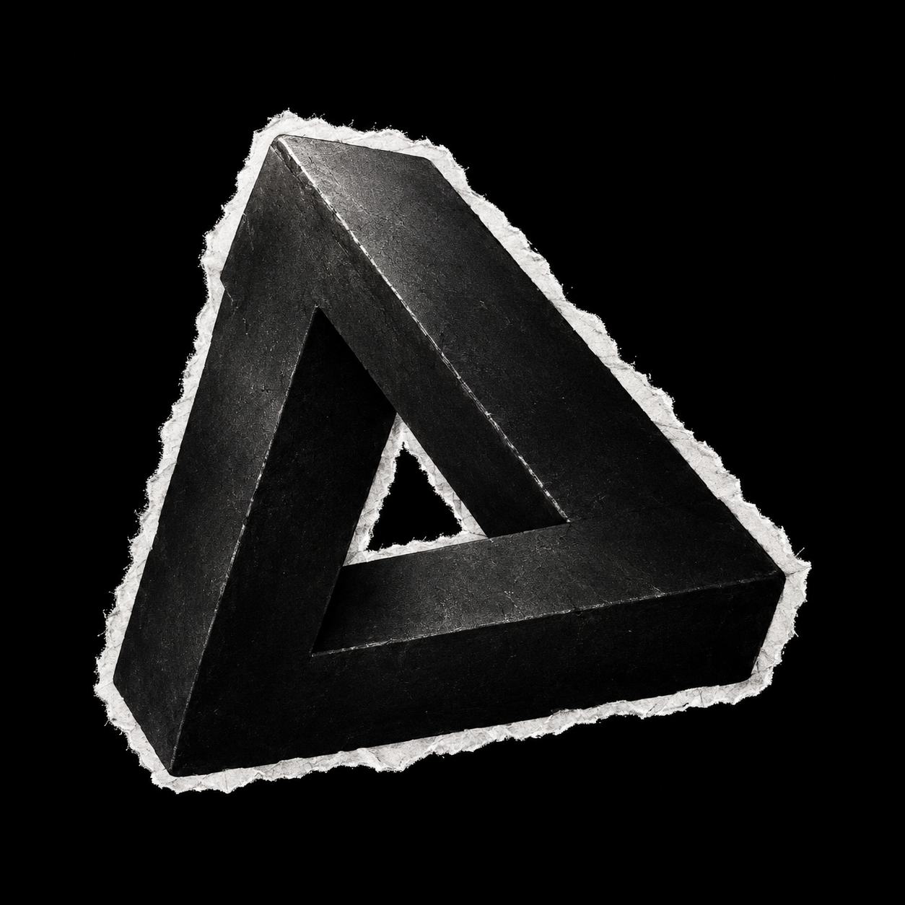

---

<strong>Know About Me</strong>

  
  

     
    
<strong>Hey there! I'm Aditya</strong>

    
A Front-End Developer with a background in Language Literature, Graphic Design and Creative Media. I build user pov websites where proper design meets seamless functionality. Balancing technical execution with strategic business goals, my focus is always on engineering web solutions that effectively solve real company problems.

  

   

---

<strong>Tech Stack</strong>

**Frontend** &nbsp;

 

**Backend** &nbsp;

 

**Database** &nbsp;

 

**Tools** &nbsp;

---

<strong>🔗 Connect</strong>

---

*"For me, coding is all about problem solving."*

